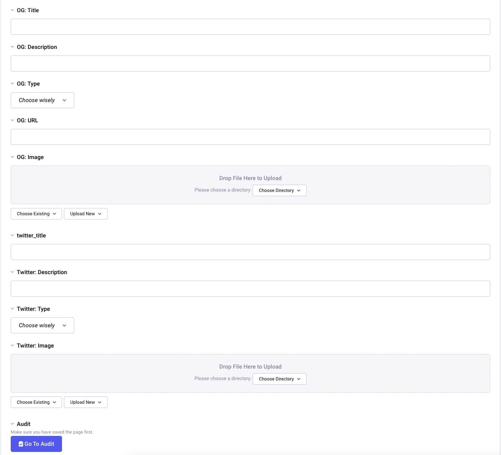
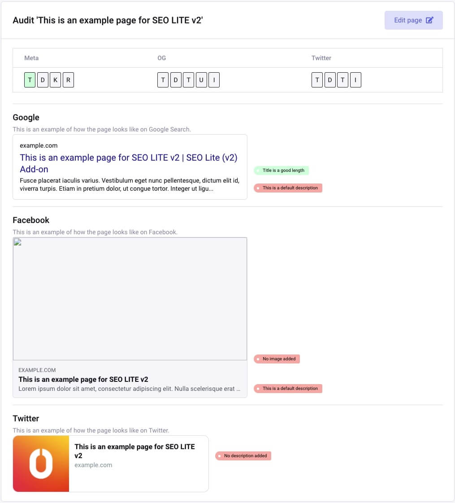

# SEO Lite (v2)
SEO Lite (v2) is a lightweight SEO addon for ExpressionEngine.

## Documentation
Put one of these tags in your template:
* Intelligent mode aka Use-Last-Segment-Mode: ```{exp:seo_lite use_last_segment="yes"}```
* By segment: ```{exp:seo_lite url_title="{segment_3}"}```
* By entry_id: ```{exp:seo_lite entry_id="{entry_id}"}```
* Static mode aka I-Will-Provide-Values-In-Template: (this will output "About Us" for the title tag but still use the default keywords/description for the site): ```{exp:seo_lite default_title="About us"}```
* Static mode with everything overridden: ```{exp:seo_lite default_title="About us" default_keywords="new, keywords" default_description="This description is unique for this page"}```

## What's new
* Twitter and OG tag support.  

* Simple audit with Google, Facebook and Twitter examples.  


## Supports
* ExpressionEngine 5
* ExpressionEngine 6

## Compatibility
* Publisher
* Structure

## Based on
SEO Lite (v2) is based on [SEO Lite by bjornbjorn](https://github.com/bjornbjorn/SEO-Lite)

## Developers
* [Robin Treur](mailto:robin@0to9.nl)